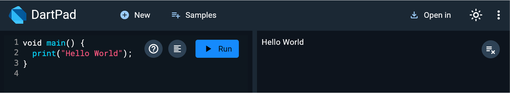

# プログラムを実行してみよう

まずは、Dartのコードを実行してみましょう。

コンソールという画面に文字を出力（表示）します。

`main() { }` の中に `print(〇〇);` というコードを書くと、中の〇〇という文字がコンソールに出力されます。

これで、無事 Dart のプログラムを動かせたことになります！

このプログラムの解説は次の「基本文法」で行います。

## Next:

[基本文法](./02_grammar.md)
