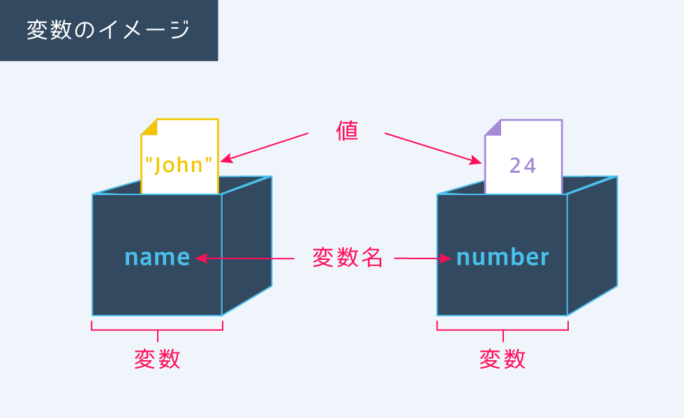
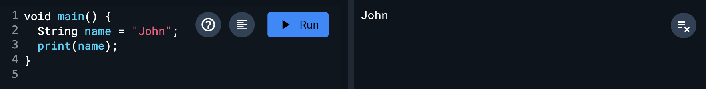
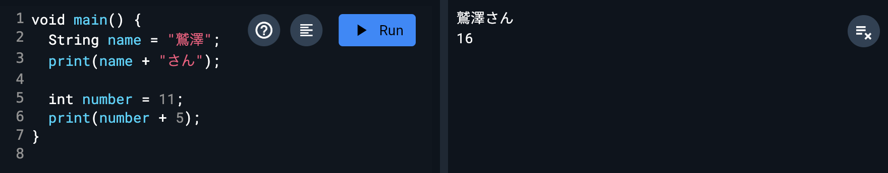
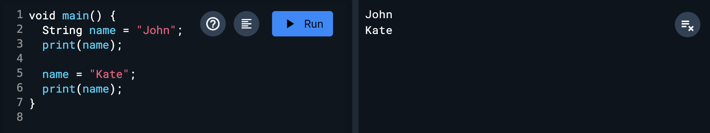
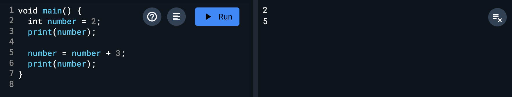

# 変数

## 変数とは

ここからは変数について勉強します。

変数は、データ（値）の入れ物（箱）です。箱についている名前が「変数名」であり、箱の中に実際の値（文字列や数値など）が入っています。

Progate, [https://prog-8.com/es6/study/1/11#/12](https://prog-8.com/es6/study/1/11#/12)

## 変数の定義

変数は「型名 変数名 = 値」として定義します。
プログラミングの「=」は「等しい」という意味ではなく、「右辺を左辺に代入する」という意味です。
型は「これから変数を定義しますよ〜」という宣言で、その後ろに変数名を書き、値を代入します。
型には種類があるので、後述します。

Progate, [https://prog-8.com/es6/study/1/11#/13](https://prog-8.com/es6/study/1/11#/13)

## 型

型は、主に以下の3種類を使い分けます。

- `int`: 32bit整数型。数字をそのままタイプする
- `String`: 文字列型。クオーテーションで文字を囲う
- `bool`: 論理値型。trueとfalseのみが入る。（[条件分岐](./05_if.md)で詳しくやります。今はスルーで！）

これらを変数名の前に置くことで、その変数が数値なのか文字列なのかなどを教えてあげる役割。 `String`のみ最初が大文字なので注意。

## 変数の使い方

変数の使い方は単純で、図のように `"John"` という値が代入された変数nameを出力すると、`"John"` という値が出力されます。

変数を使うと変数の部分は代入した値に置き換わります。

## 変数の特徴

変数は、これまでに学習してきた「文字列」や「数値」とまったく同じように扱えます。

代入されている値が、文字列の場合は他の文字列と連結することができ、数値の場合は計算に用いることができます。

## なぜ変数を使うのか

実際のプログラムの中には多くの値が登場します。プログラムを書く時は、それらの値を間違いのないように、そして値の変更に対応しやすいようにすることが求められます。それを助けるための1つの仕組みが変数です。変数には以下のようなメリットがあります。

1. 同じ値を繰り返し使える
2. 変更に対応しやすい
3. 値の意味がわかりやすい

### 変数のメリット

「同じ値を繰り返し使える」「変更に対応しやすい」という具体例を見てみましょう。図のように似た文章を何度も書くのは面倒ですが、変数を使えば同じ値を繰り返し使え、楽にコードを書くことが出来ます。また文章が後ほど変更されても、変数を用いていれば、代入する値を変更するだけで全ての変更に対応できます。

## 変数の命名ルール

変数名は自由に決めることができますが、できるだけ分かりやすい名前をつけるようにしましょう。

<aside>

### ✅ 良い例

- number　　・・・英単語を用いる
- oddNumber   ・・・2語以上の場合は大文字で区切る
</aside>

<aside>

### ❌ 悪い例

- 1number　・・・数字で開始（エラーが出る）
- bango　　・・・ローマ字（望ましくない）
- 番号　　　 ・・・日本語（望ましくない）
</aside>

## 変数の更新

変数は、一度代入した値を変更することもできます。一度値を代入した変数に、その後再び値を代入すると、後に代入した値で変数の中身が上書きされます。

定義する時と違って型の宣言は必要なく、「変数名 = 新しい値」と書けば値が変更されます。

また、プログラムは上から順に実行されるので、後から代入された値で変数の中身が更新されます。

## 変数自身を更新する

すでに定義している変数numberの値に3を足したい、というときはどのようにすればよいでしょうか。

これは図のようにnumberに3を足して、再びnumberに代入することで実現できます。「=」の右側のnumberは値に置き換わり、計算された結果が、左のnumberに代入されています。

### 省略した書き方

`number = number + 〇〇` といった書き方には、省略した書き方もあります。 よく使うので、ぜひ覚えましょう。

| 基本形 | 省略形 |
| --- | --- |
| x = x + 10 | x += 10 |
| x = x - 10 | x -= 10 |
| x = x * 10 | x *= 10 |
| x = x / 10 | x /= 10 |
| x = x % 10 | x %= 10 |

## Next:

[定数](./04_const.md)
