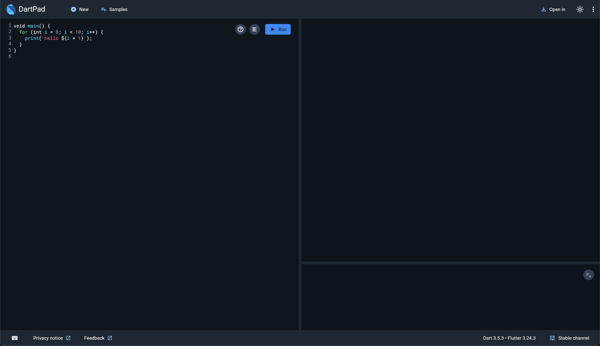

# Let's study Dart !

## コードを書く環境を用意！

[https://dartpad.dev/](https://dartpad.dev/) にアクセス

- エディタ(左): ここにDartのコードを書く
- コンソール(右): プログラムの出力結果や、エラーが出る
- RUNボタン: プログラムを開始する

ご自身のPCに Dart/Flutter を書くための環境を整備するまでは、このオンラインのエディタを使用します。

## プログラムの基本

入力 → なんらかの処理 → 出力

> 入力は無いことも多い

最初の方はフローチャートを考えながらやると便利

## 下記を参考に進めていってください！

### 基本的に上から順にやっていけばOK

途中、画像でプログラムのサンプルが出てくるので、実際にオンラインエディタで書いて実行してみましょう！！

---

## Next: 環境構築

[プログラムを実行してみよう](./01_run.md)
