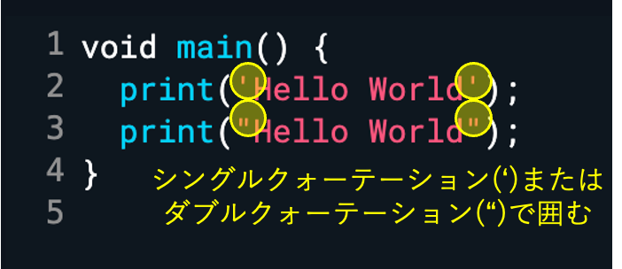

# 基本文法

## print()

プログラムの書き方をより詳しく見ていきましょう。

`print()`は丸括弧()内に入力された文字をコンソールに出力します。

また、「Hello World」のような文字のことを「文字列」と呼びます。文字列は、図のようにシングルクォーテーション(`‘`)かダブルクォーテーション(`“`)で囲む必要があるので注意！

文字列をクォーテーションで囲まないとエラーが出ます！

## セミコロン

文の最後にはセミコロン(;)を付けないといけない。

## コメントアウト

文頭に`//`を書くと、その行はコメントと見なされます。そのため、プログラムとしては無視され、実行されません（コメントアウトと言う）
コメントは、どのような意味のコードであるかを記すメモとして使われます。

## 数値と計算

プログラミングでは、数値（数字）を扱うこともできます。数値は文字列と違い、クォーテーションで囲みません。
数値は足し算や引き算といった四則演算をすることができます。以下のような記号で計算しますが、これら数値と記号は全て半角で記述することに注意！

## 文字列と数値

図のように、 `print(5 + 2);` は足し算の結果である7が出力されます。
一方、「5 + 2」にクォーテーションを付けると、文字列と解釈されそのまま出力されます。

文字列と数値は明確に違うものであることを意識しましょう。

## 文字列の連結

「+」記号を用いると、文字列同士を連結することができます。

図のように「”福沢” + “諭吉”」とすると、「”福沢諭吉”」という1つの文字列になります。

## Next:

[変数](./03_var.md)
