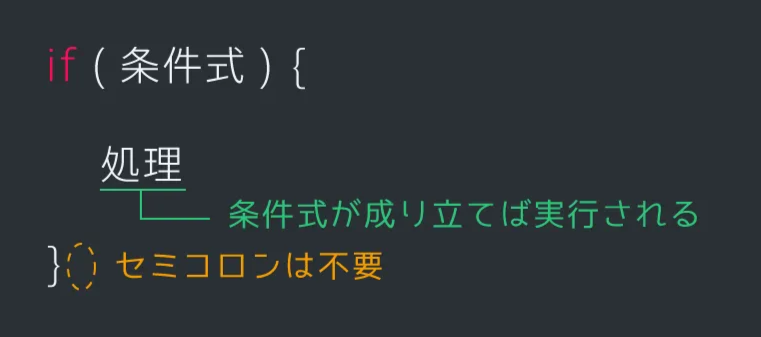
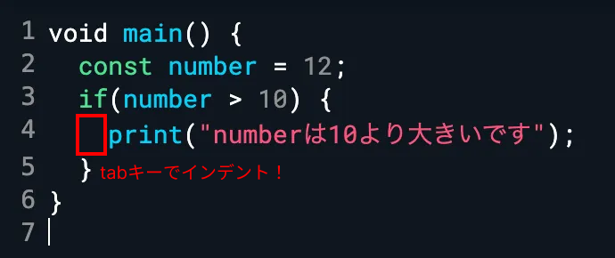
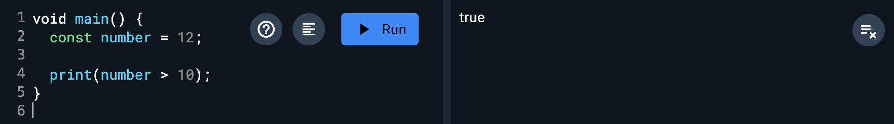
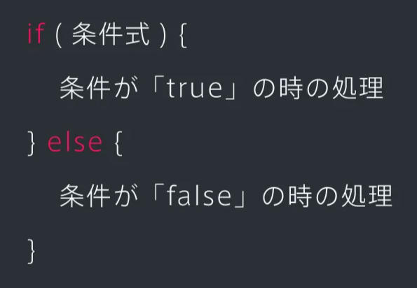
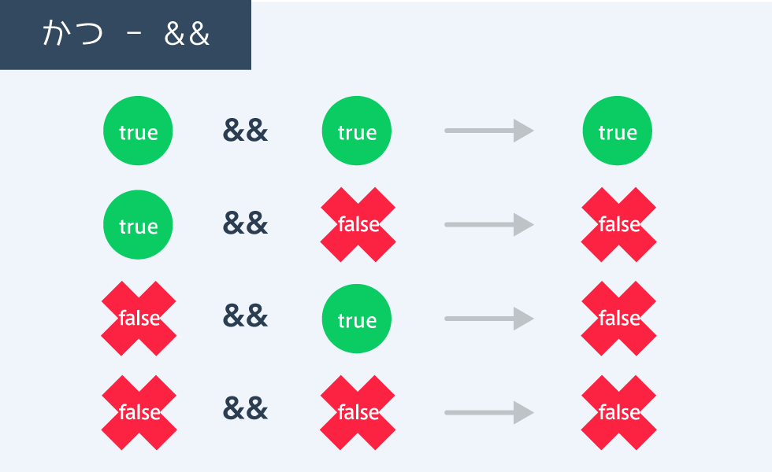

# 条件分岐

## if文

次に、プログラミングにおいて重要な**条件分岐**についてです。

プログラミングを学んでいると「ある条件が成り立つときだけある処理を行う」という場面が出てきます。このようなプログラムを条件分岐と言います。

if文を用いると「もし○○ならば●●を行う」という条件分岐が可能になります。ifの後ろに条件式を書き、それが「成り立つ」場合の処理を{ }の中に書きます。



例えば、「12」という数字を10と比較し、10より大きい場合に「10より大きいです」と出力するとき、このように考えられます。

```dart
const number = 12;
if( numberが10より大きい場合 ) {
	print("numberは10より大きいです");
}
```

実際のコードを見てみましょう。

```dart
const number = 12;
if(number > 10) {
	print("numberは10より大きいです");
}
```

<aside>

### 💡 if文を書くときのポイント

if文を書くときは、インデントをするようにしましょう。

インデントとは日本語で「字下げ」を意味します。きれいにインデントするとコードが見やすくなります。下図のようにインデントを入れることでifの処理がどこからか一目でわかります。

tabキーを押すと、インデントすることができます。



</aside>

## 真偽値と比較演算子

### 真偽値

if文を使うことができました。次は条件式の部分を詳しく見てみます。図のように、先ほどのif文の条件式の部分を出力してみると、「true」が出力されています。このtrueとは一体なんでしょうか？



この「true」は真偽値と呼ばれるものです。真偽値にはtrueとfalseという2つの値しか存在しません。条件式は、成り立つと「true」、成り立たなければ「false」という真偽値に置き換わります。

### 比較演算子

条件式に使った「>」は比較演算子と呼ばれる、大小比較の記号です。「a < b」は、aの方がbより小さいときtrue, 大きいときfalseになります。また「a <= b」とすると、aの方がbより小さいまたは等しい（つまりb以下）のときtrueになります。これは数学で用いる「≦」という記号と似ています。

比較演算子を使うことで条件に適合しているかどうか調べることができます。

- `==`: 左右が同じ値のときにtrue
- `!=`: 左右が違う値のときにtrue
- `>`: 左のほうが大きいときにtrue
- `<`: 左のほうが小さいときにtrue
- `>=`: 左右同じか左のほうが大きいときにtrue
- `<=`: 左右同じか左のほうが小さいときにtrue

```dart
"野口" == "野口" // -> true
"英世" != "千円" // -> true
5 > 6 // -> false
5 < 5 // -> false
7 >= 7 // -> true
7 <= 9 // -> true
```

## 条件が成り立たないときの処理

if文の条件式が成り立たない場合に、別の処理を行いたい場合があります。例えば、numberの値が10より大きくない場合には「10以下です」と出力する方法を学んでみましょう。

下の図のように、if文に「else」を組み合わせると「もし〇〇なら●●を行う、そうでなければ■■を行う」という処理ができるようになります。

if文の条件がfalseの場合、elseの処理が実行されます。



elseを使った実際のコードを見てみましょう。

上側は、numberの値が10より大きいかどうかで処理を分けたい場合にif文のみを使用した例です。この場合、2つのif文を作成する必要があります。

一方、下側のコードのようにelse文を用いると、1つの条件分岐で同じことを実現できます。

```dart
// elseを使わない場合：複数のif文が必要
const number1 = 7;
if(number1 > 10) {
	print("number1は10より大きいです");
}
if(number1 <= 10) {
	print("number1は10以下です");
}

// elseを使う場合：1つの条件式で成立する
const number2 = 7;
if(number2 > 10) {
	print("numberは10より大きいです");
} else {
	print("numberは10以下です");
}
```

さらに条件分岐を追加したい場合は、ifとelseの間に「else if (条件)」を挟みます。

```dart
const number = 7;
if(number > 10) {                 // false
	print("numberは10より大きいです");
} else if(number > 5) {           // true
	print("numberは5より大きいです");
} else {
	print("numberは5以下です");
}
```

## かつ

複数の条件を組み合わせる方法を学びましょう。まずは「かつ」についてです。「かつ」は「&&」で表します。「条件1 && 条件2」は「条件1かつ条件2」という意味で、複数の条件がすべてtrueならtrueになります。

下の「10より大きいかつ30より小さい」は、「10 < x < 30」と書くことは出来ません。このようなときは「&&」を使いましょう。




## または

次は「または」を表す記号です。

「または」は「||」で表します。「条件1 || 条件2」は「条件1または条件2」という意味です。この場合は、複数の条件のうち1つでもtrueならtrueになります。


### 具体例

「number >= 10」も「number < 100」もともにtrueなので、処理が実行されています。

```dart
const number = 31;
if(number >= 10 && number < 100) {
	print("numberは2桁です");
}
```

## 演習問題

level変数 ( `int` ) を作って、任意のレベル（初期値）を代入し、50レベル以上なら「つよい」と表示するプログラムを作る。

また、「つよい」と言われるのにあと何レベル必要か教えてあげる。

- **ヒント**
    - level変数の初期値を”50”と比較してみよう！
    - level変数を作成 → 初期値を代入 → 比較 → 文字を表示 の順
- ヒント2
    - 50レベル以上なら「つよい」と表示する。そうじゃない場合は何レベル足りてないか教えれば良い。2つの条件をもとに動作を決めるから、使う文法は…？
- ヒント3
    - 何レベル足りていないかは、50から初期値分のレベルを引けば出せる

- 答え

    ```dart
    void main() {
      int level = 10;

      if (level >= 50) {
        print("つよい");
      }
      else {
        int rem = 50 - level;
        print("あと $rem レベル足りないよ");
      }
    }
    ```


## Next:

[繰り返し](./06_repeat.md)
