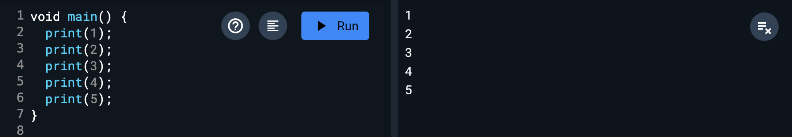
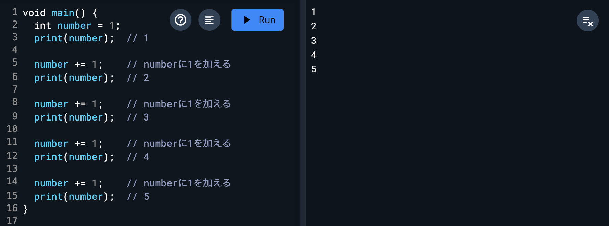
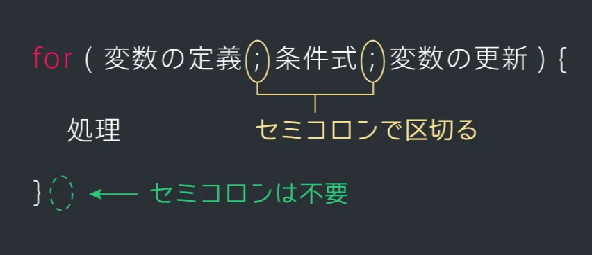
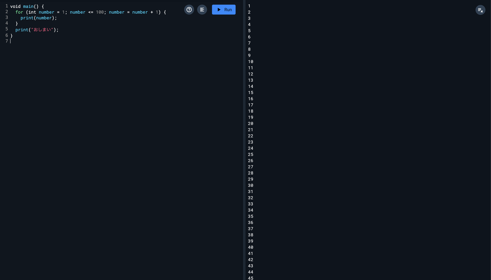

# 繰り返し

## 変数の復習

変数の使い方を復習してみましょう。

まずは、コンソールに1から5までの数字を順番に出力してみます。

このように1から順番にconsole.logで出力していくことでできます。



ですが今回は「変数」の復習も兼ねて、以下のように変数numberを用意し、1回ずつ自分自身に1を足していきましょう。



## 繰り返し

次に、1から100までの数字を出力する場合を考えてみましょう。

前項と同じように、自分自身に1を足して出力する部分を100回書けばできますが、それはさすがに大変すぎますね。

このような場合には「繰り返し処理」というものを用いると便利です。その方法を学習してみましょう。

## for文

繰り返し処理を行うには「for文」というものを用います。

for文は以下のように書き、「条件式がtrueの間、 {}内の処理を繰り返す」ことができます。{}の後にセミコロンは不要です。



これで、1から100までを出力すると以下のようになります。



「number += 1」は「number ++」のように省略して書くことができます。また、引き算の場合にも、「number -= 1」を「number --」と省略することができます。

## 演習問題

1から100の数字を出力する。ただし、3の倍数の時は「3の倍数です」と出力すること。使用する変数名は `number`とする。

- **ヒント**
    - 繰り返し以外も含め、今まで勉強したことを思い出して書いてみよう！
- ヒント2
    - 1から100までの繰り返しをしながら、3の倍数という条件下で動く処理を追加しないといけない。条件によって動作を分けたいから…
- ヒント3
    - 3の倍数の条件は、「変数numberに代入されている数字が3で割り切れるか（3で割って余りが0になるかどうか）」を見れば良い。

- 答え

    ```dart
    void main() {
      for (int number = 1; number <= 100; number++) {
    	  if (number % 3 == 0) {
    		  print("3の倍数です");
    	  } else {
    		  print(number);
    	  }
      }
    }
    ```


## Next:

[配列](./07_array.md)
