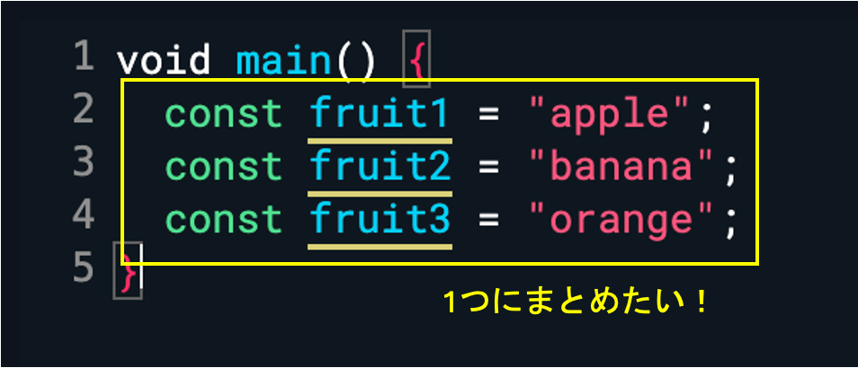
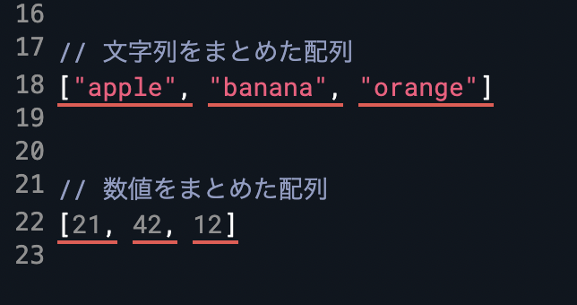
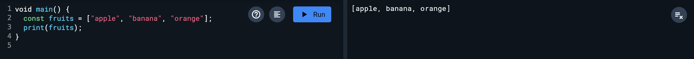
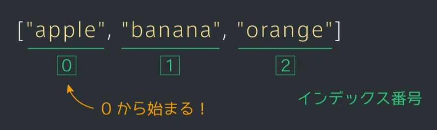
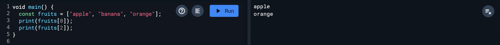
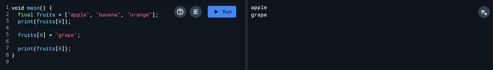
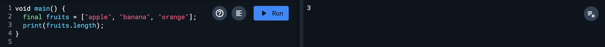

# 配列

## 複数の値をまとめて扱う

複数の値をまとめて扱う方法について勉強します。

例えば、果物の名前についての値がいくつもあるとき、それぞれを定数（変数）として定義するより、「果物の名前一覧」といったように、関連する値をまとめて管理すると便利です。



## 配列

複数の値をまとめて管理するには、「配列」というものを用います。

配列は、[値1, 値2, 値3] のように作ります。配列に入っているそれぞれの値のことを「要素」と呼びます。

配列を使うと、画像のように複数の文字列や数値をまとめて書くことができます。



配列も1つの値なので、定数に代入することができます。

このとき、配列を代入する定数名は、慣習上複数形にすることが多いので覚えておきましょう。

画像のように、「print(定数名)」とすると、配列がコンソールに出力されます。



## インデックス番号

配列の要素にはそれぞれインデックス番号という番号がついています。

インデックス番号は、0から始まることに注意しましょう。



インデックス番号を用いて配列の要素を取得してみましょう。

`配列[インデックス番号]`とすることで配列の要素を取得することができます。

例えば「apple」の取得は、画像のように、appleのインデックス番号である0を用いて `fruits[0]`とすることで可能です。



## 要素の更新

配列は画像のように、要素に値を代入することでその要素を上書きすることができます。



<aside>

💡 constで配列を定義していると要素の変更ができない。finalで配列を定義しなおし、要素の更新をしてあげる。
finalは「一度作ったものを別のものに変えることはできないけれど、中身は変えられる」という性質を持っているところがポイント。

</aside>

## 配列と繰り返し

配列に対して繰り返し処理を行うことがしばしばあります。

for文を使って配列の要素を順に取り出すようにしてみましょう。

配列fruitsの要素数が3の場合、すべての要素を出力するには、このように書かなけばなりません。

```dart
const fruits = ["apple", "banana", "orange"];

print(fruits[0]);
print(fruits[1]);
print(fruits[2]);
```

これをfor文で書き直すと下記のようになります。このようにすれば配列の中に格納されているすべての値を簡単に出力することができます。

```dart
const fruits = ["apple", "banana", "orange"];

for (int i = 0; i < 3; i++) {
	print(fruits[i]);
}
```

この際、変数の値は0から始めることに注意しましょう。

また、画像のように `配列.length`とすることで、配列の要素数を取得できます。



また、lengthを用いれば、先ほどのfor文の条件式を以下のように書き換えることができます。配列の要素数が変わっても問題なく繰り返すことができるので便利です。これは配列の繰り返し処理でよく使う書き方なので、覚えておきましょう。

```dart
const fruits = ["apple", "banana", "orange"];

for (int i = 0; i < fruits.length; i++) {
	print(fruits[i]);
}
```

## Next:

[関数](./08_func.md)
