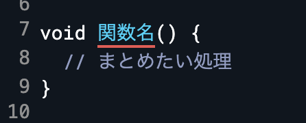
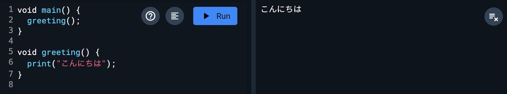
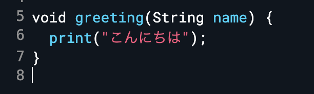
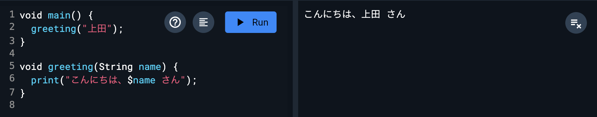
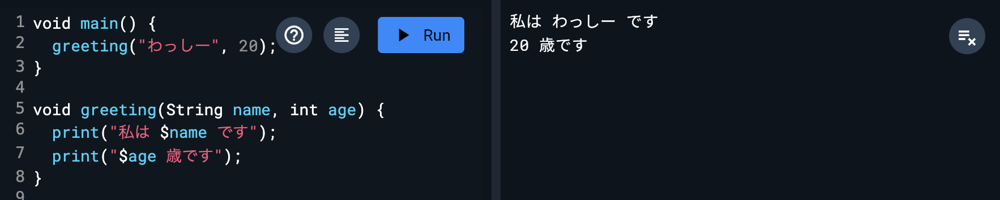
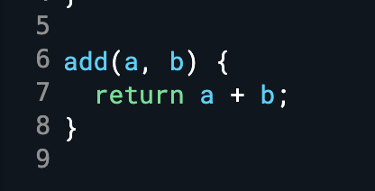
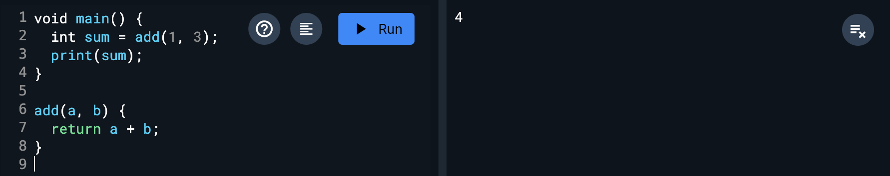
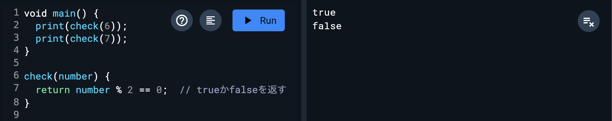
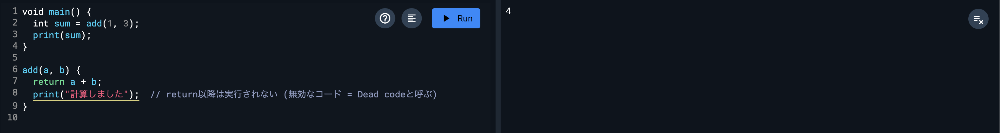
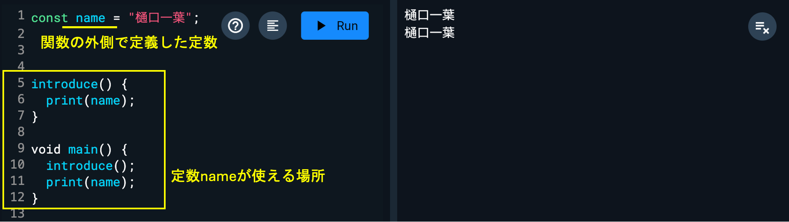

# 関数

## 関数とは

関数とは、「いくつかの処理をまとめたもの」です。

それだけ！

## 関数の定義

下の画像のように関数名を書き、その後ろの中括弧「{ }」の中にまとめたい処理を書くことで関数を用意することができます。

また、このように関数を用意することを「関数を定義する」と呼びますので覚えておきましょう。



<aside>

💡 今まで Dart Pad でコードを書いていたのも、「main」という名前の関数の中です。

</aside>

関数を定義しただけでは、その中の処理は実行されません。

定義した関数名を用いて、「関数名()」と書くことで関数の中の処理を実行できます。このことを「関数を呼び出す」と言います。



実際に、自分で好きな関数名と処理を書いて、main()関数の中で呼び出してみましょう！！

関数名は変数の時と同じく、処理の内容が伝わりやすいネーミングにしましょう。（上の画像では、挨拶をprintする処理なので、「greeting」という関数名にしています。）

## 引数

引数（ひきすう）とは関数に与える追加情報のようなものです。

関数を呼び出すときに一緒に値を渡すことで、関数の中でその値を利用することができます。

引数を受け取る関数を定義してみましょう。

図のように、「関数名(引数名) {}」と括弧の中に引数名を書くことで

引数を受け取ることができます。



引数は関数内では定数や変数と同じように使用することができます。



複数の引数を同時に渡すことも可能です。

複数の引数に値を渡して関数を呼び出すには、定義するときと同じように、コンマ(,)を用います。

渡す引数の順番と関数を定義したときの引数の順番は対応しているので、関数を呼び出すときは引数の順番に気をつけましょう。



## 返り値・戻り値

ここからは、関数の処理結果を呼び出し元で受け取る方法を学びます。

呼び出し元で受け取る処理結果を返り値（かえりち）もしくは戻り値（もどりち）と呼び、このことを「関数が戻り値を返す」と言います。

呼び方が2つあるのは宗派です。好きな方で呼んであげてください。

関数の中でreturnを使うと、呼び出し元で値を受け取れるようになります。

`return 値`と書くことで、関数はその値を返り値として返します。

下の画像では、aとbを足した値が返り値として呼び出し元に返ります。



呼び出した関数に返り値がある場合、関数の呼び出し部分がそのまま返り値に置き換わります。



## 戻り値・返り値の活用

返り値も引数と同様に、様々な値を用いることができます。

例えば、if文で使うような条件式をreturnすると、その条件式の結果として得られる真偽値（trueまたはfalse）を返すことができます。



## returnによる処理の終了

returnについて詳しく見てみましょう。

returnは、返り値を返すだけでなく、関数の処理を終了させる性質も持っています。よって、returnの後にある関数内の処理は実行されませんので注意しましょう。



## スコープ

定数や変数の使用できる範囲のことをスコープと呼びます。スコープは、図のように定数や変数を定義した場所によって異なります。

関数の外側で定義した変数や定数は、プログラムのどこからでも使えます。



関数の `{}`内で定義した変数や定数は、その関数の内側でのみ使用できます。図のように、関数の内側で定義された定数を関数の外側で使用するとエラーになるので注意しましょう。


<aside>

💡 少し汚い話ですが、単純にこういう考え方もできるよ、という例

[https://wa3.i-3-i.info/diff989programming.html](https://wa3.i-3-i.info/diff989programming.html)

</aside>

## 演習問題

時間を分に換算するtoMinutes関数を作成してください。この関数は時間（hour）と分（minutes）の数値を引数に受け取り、分に換算した結果を返り値として返します。

使用する関数は、toMinites関数とmain関数のみとします。

- **ヒント**
    - `toMinites`関数を `main`関数で呼び出して実装。
    - `toMinites`関数で時間換算の式を作り、 `main`関数で実数を渡してあげる。
- ヒント2
    - 引数は `hour`と `minites`の2つ。引数定義は `hour, Minites` とし、引数の値の指定は、1時間30分だったら `1, 30`などとすれば良い。
- ヒント3
    - 計算は、1時間を60分に直す + 渡された `minites`を足せば良い。

- 答え
    
    ```dart
    toMinites(hour, minites) {
    	return hour * 60 + minites;
    }
    
    void main() {
    	int result = toMinites(1, 45);
    	print("$result分");
    }
    ```

## Next:

[クラス](./09_class.md)
