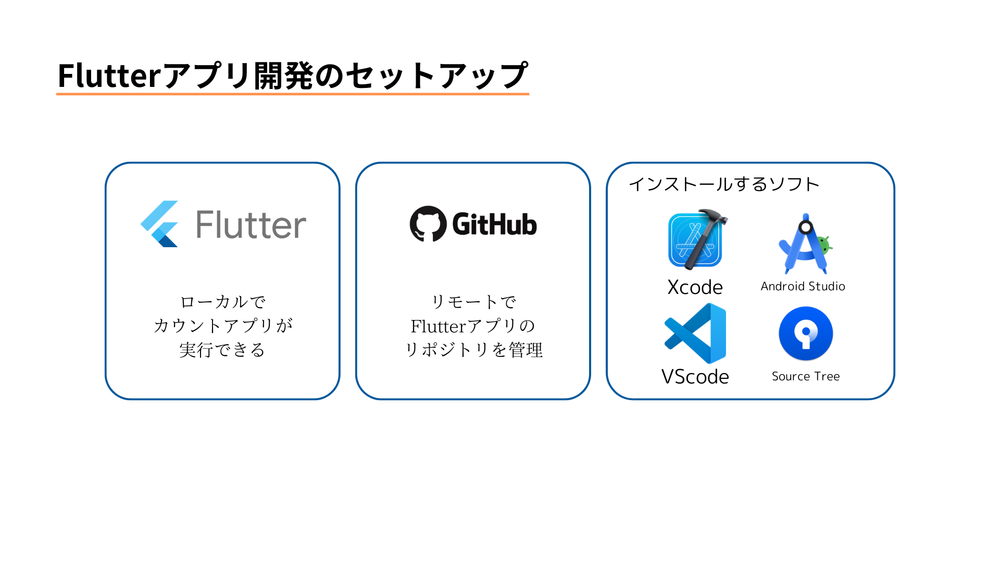
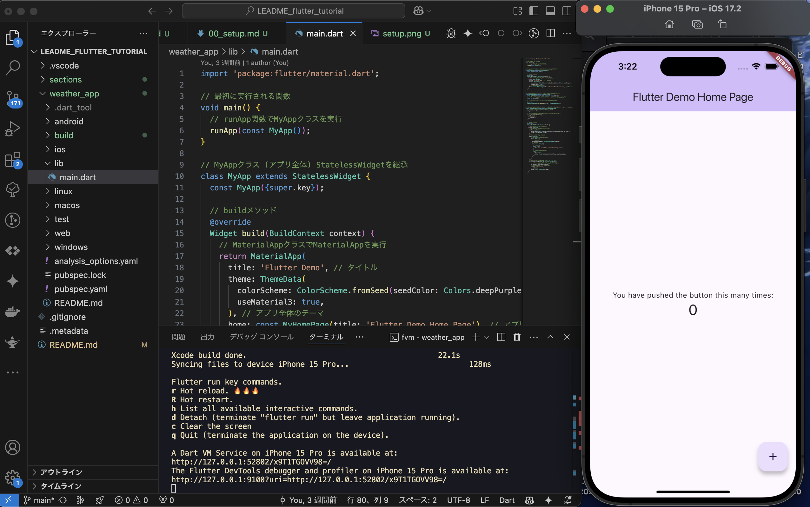
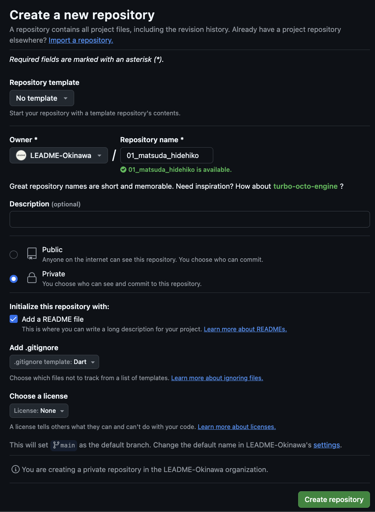
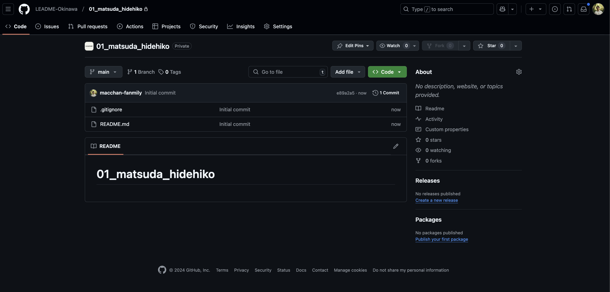
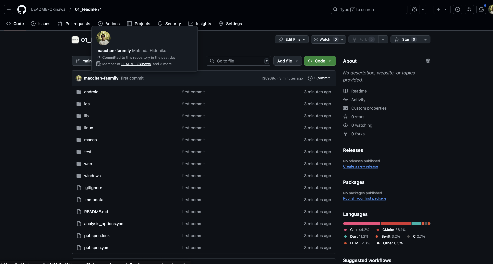

# セットアップ




## Flutter環境構築

みなさんのPC上（ローカル）でスクショのような「カウントアプリ」が実行できるようにしましょう！

[こちら](https://zenn.dev/kazutxt/books/flutter_practice_introduction/viewer/06_chapter1_environment)を参考に環境構築を進めていきましょう。


スクショのようにiPhoneシミュレータかAndroidエミュレータでflutter runが実行できればFlutterの環境構築完了です！



# Githubのセットアップ

flutterのアプリのコードがGithub上にアップされるのがゴールです！


### 1. [こちら](https://github.com/orgs/LEADME-Okinawa/repositories)よりリポジトリの作成
    - リポジトリ名は「01_姓_名」
    - Privateを選択
    - README fileのチェックをつける
    - Add .gitignoreで「Dart」を選択






これらの画面に遷移したら完成だ！


✓ その後の手順

```
2. sshの設定をする
3. リモートリポジトリをクローンする
4. flutterのコードをgithubのリポジトリにプッシュする
```

Github上でFlutterのソースコードがアップロードされていれば完成！




## 課題の提出
[課題提出フォーム](https://ejpxku8gbq5l.jp.larksuite.com/share/base/form/shrjpjg5vi2xLBI9bbrobYZDZEe)にリポジトリのリンクを記載してフォームを送信してください！

## NEXT: 
