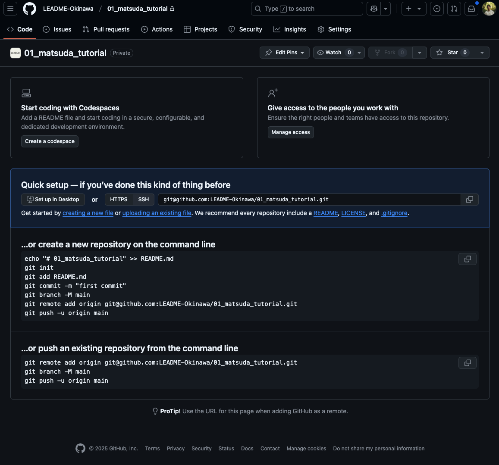

# セットアップ


## Flutter環境構築

みなさんのPC上（ローカル）でスクショのような「カウントアプリ」が実行できるようにしましょう！

[こちら](https://zenn.dev/kazutxt/books/flutter_practice_introduction/viewer/06_chapter1_environment)を参考に環境構築を進めていきましょう。


スクショのようにiPhoneシミュレータかAndroidエミュレータでflutter runが実行できればFlutterの環境構築完了です！


### 環境構築でつまづいた時、これで解決した！
- [Flutter コマンドが反応しない](https://zenn.dev/tsuruo/scraps/498e35e82de0b1#comment-8381e46855a14f)
- [Flutter doctorでandroidのエラーが出る](https://zenn.dev/imasaka0909/articles/00ebfaf74f9cea)
    


# Githubのセットアップ

flutterのアプリのコードがGithub上にアップされるのがゴールです！


## 1. [こちら](https://github.com/orgs/LEADME-Okinawa/repositories)よりリポジトリの作成
---
    - リポジトリ名は「01_姓_名」
    - Privateを選択
    - README fileのチェックを外す
    - Add .gitignoreで「Dart」を選択




これらの画面に遷移したら完成だ！


✓ その後の手順

```
2. ローカルでgitのインストール・設定
3. ローカルリポジトリをリモートリポジトリにpushする
```

## 2. ローカルでgitのインストール・設定
---

### 2.1. まずgitをローカルにインストール
[こちら](https://git-scm.com/downloads)よりインストールできます。

### 2.2. 「git config --global user.email "メアド"」で自分のメールアドレスを設定

メアドは、githubで登録しているメールアドレスです！

VSCodeでFlutterプロジェクトを開こう！

VSCodeのターミナルでgit config コマンドを実行しよう！

松田の場合は

```
git config --global user.email "hidehiko.matsuda@fan-mily.com"
```


### 2.3. githubの指示にあるコマンドを実行していく
 
 githubの自分が作成したリポジトリに書いてあるコマンドを順番に実行してみよう！

こちらのコマンドはする必要がないので省略
```
echo "# 01_matsuda_tutorial" >> README.md
```

1. git 初期化
``` 
git init
```

2. READMEファイルをステージングにあげる
```
git add README.md
```

3. コミットする
```
git commit -m "first commit"
```

4. メインブランチ名を「main」にする
```
git branch -M main
```

5. リモートリポジトリと接続する
```
git remote add origin git@github.com:LEADME-Okinawa/01_matsuda_tutorial.git
```

6. リモートリポジトリにプッシュする
```
git push -u origin main
```

そうすると、スクショのようにgithub上にファイルが追加されます！


これで、リモートリポジトリとローカルリポジトリの接続がうまくいきました！
それでは、ローカルリポジトリにあるFlutterのすべてのソースコードをリモートリポジトリにアップしましょう！

VSCodeのターミナルで

1. すべての変更ファイルをステージングにあげる

```
git add .
```

2. コミットする

```
git commit -m "Flutterプロジェクト"
```

3. プッシュする

```
git push
```


Github上でFlutterのソースコードがアップロードされていれば完成！


## 課題の提出
[課題提出フォーム](https://ejpxku8gbq5l.jp.larksuite.com/share/base/form/shrjpjg5vi2xLBI9bbrobYZDZEe)にリポジトリのリンクを記載してフォームを送信してください！

## NEXT: 
[天気予報アプリの画面レイアウトを構成する](../section3/session1_layout.md)
