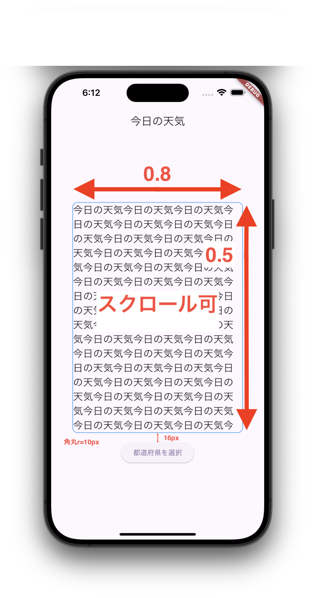

# 天気予報アプリの画面レイアウトを構成する

## 課題

以下の条件の画面レイアウトを作ってみましょう。

### レイアウト仕様
1. AppBarのタイトルを「今日の天気」
2. 画面の中心に今日の天気の文章を表示させるContainerと都道府県を選択するボタンを設置
3. 今日の天気Containerのサイズは、横幅が画面の横幅の0.8倍、縦幅は画面の縦幅の0.5倍
4. Containerには枠線をつける
5. Containerの枠線を10px分角丸にする
6. Containerの中のテキストは文章量が多い場合はスクロールしてみれるようにする
6. 都道府県を選択するボタンの上部に16px、paddingを設ける

## NEXT: 
[画面遷移を実装する](./session2%20navigation.md)