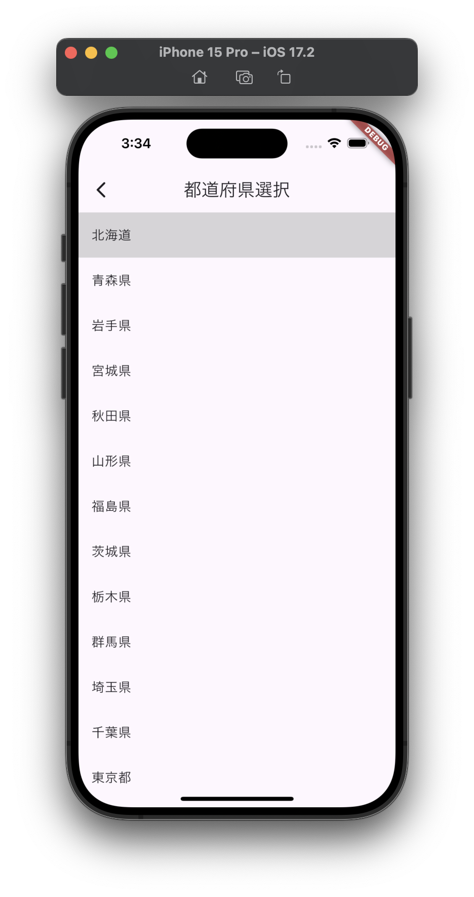

# API連携で敵予報データを取得する


## 課題

選択した都道府県の天気情報データをAPIを叩いて取得しよう！

今回叩くAPIはこちら

```
https://www.jma.go.jp/bosai/forecast/data/overview_forecast/130000.json
```

このURLを開いてみましょう！

そうすると

```
{"publishingOffice":"気象庁","reportDatetime":"2025-01-16T10:39:00+09:00","targetArea":"東京都","headlineText":"","text":"　大陸に中心を持つ高気圧が西日本から東日本に張り出しています。一方、日本海と伊豆諸島付近は気圧の谷となっています。\n\n　東京地方は、おおむね曇りとなっています。\n\n　１６日は、高気圧に覆われますが、気圧の谷の影響を受ける見込みです。このため、曇りで、夜は晴れるでしょう。\n\n　１７日は、低気圧が北日本を通過し、冬型の気圧配置となりますが、午後は次第に緩み高気圧に覆われる見込みです。一方、伊豆諸島付近は気圧の谷となるでしょう。このため、晴れますが、朝晩は曇りとなる見込みです。\n\n【関東甲信地方】\n　関東甲信地方は、晴れや曇りとなっています。\n\n　１６日は、高気圧に覆われますが、気圧の谷の影響を受ける見込みです。このため、晴れや曇りで、長野県では夜遅く雪の降る所があるでしょう。\n\n　１７日は、低気圧が北日本を通過し、冬型の気圧配置となりますが、午後は次第に緩み高気圧に覆われる見込みです。一方、伊豆諸島付近は気圧の谷となるでしょう。このため、晴れや曇りで、長野県や関東地方北部では雪の降る所がある見込みです。\n\n　関東地方と伊豆諸島の海上では、１６日から１７日にかけて、うねりを伴い波が高い見込みです。船舶は高波に注意してください。"}

```

というjsonデータが表示されますね！

これがAPIを叩いた時に返ってくるレスポンスです！

今回の課題は、ホーム画面の「今日の天気...」としていた部分に、このレスポンスの `text` keyのvalueを表示させてください！

つまり、

```
"text":"　大陸に中心を持つ高気圧が西日本から東日本に張り出しています。一方、日本海と伊豆諸島付近は気圧の谷となっています。\n\n　東京地方は、おおむね曇りとなっています。\n\n　１６日は、高気圧に覆われますが、気圧の谷の影響を受ける見込みです。このため、曇りで、夜は晴れるでしょう。\n\n　１７日は、低気圧が北日本を通過し、冬型の気圧配置となりますが、午後は次第に緩み高気圧に覆われる見込みです。一方、伊豆諸島付近は気圧の谷となるでしょう。このため、晴れますが、朝晩は曇りとなる見込みです。\n\n【関東甲信地方】\n　関東甲信地方は、晴れや曇りとなっています。\n\n　１６日は、高気圧に覆われますが、気圧の谷の影響を受ける見込みです。このため、晴れや曇りで、長野県では夜遅く雪の降る所があるでしょう。\n\n　１７日は、低気圧が北日本を通過し、冬型の気圧配置となりますが、午後は次第に緩み高気圧に覆われる見込みです。一方、伊豆諸島付近は気圧の谷となるでしょう。このため、晴れや曇りで、長野県や関東地方北部では雪の降る所がある見込みです。\n\n　関東地方と伊豆諸島の海上では、１６日から１７日にかけて、うねりを伴い波が高い見込みです。船舶は高波に注意してください。"
```

これの「大陸...」以降のテキストのみを表示させると言うことです！


ちなみに、APIリクエストの `130000` は都道府県コードです！
前回の課題でセットした　`jsonStringPrefecture` の 'key' をリクエストパラメータにセットすると、選択した都道府県の天気情報を取得してきますよ！

```
https://www.jma.go.jp/bosai/forecast/data/overview_forecast/130000.json
```





